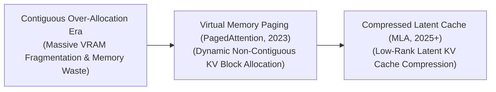
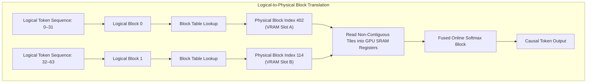

# Awesome-Paged-Attention
## PagedAttention: History, Progression, Variants, & Applications

**PagedAttention** is a hardware-aware memory management algorithm designed to eliminate memory fragmentation and optimize Video RAM (VRAM) utilization during the autoregressive decoding phase of Large Language Models (LLMs). Developed by Kwon et al. in 2023 ("Efficient Memory Management for Large Language Model Serving with PagedAttention") and commercialized via the **vLLM** engine, the framework resolves the severe Key-Value (KV) cache bottleneck [INDEX: 22]. 

In standard autoregressive inference, the memory required to host historical token states grows linearly with sequence length [INDEX: 22]. Traditional serving infrastructures allocated large, contiguous blocks of virtual memory to store these tensors based on the maximum possible context limit. This created massive VRAM waste due to internal and external memory fragmentation. PagedAttention solves this crisis by adapting the classical operating system principle of virtual memory paging: partitioning the KV cache into small, non-contiguous physical blocks [INDEX: 22], allowing models to serve massive concurrent user batches with near-zero memory waste.

---

## 1. The Macro Chronological Evolution

The implementation of KV cache management has transitioned from rigid, contiguous memory allocations to dynamic virtual paging and hardware-fused low-rank latent cache compressions.

*   **The Contiguous Over-Allocation Era (Traditional LLM Serving, Pre-2023)**
    *   *Concept:* The structural baseline [INDEX: 22]. Because GPU kernels require contiguous memory layouts to execute parallel matrix multiplication efficiently, early serving systems allocated massive, unbroken chunks of VRAM upfront based on the model's maximum context length boundary (e.g., reserving slots for 2,048 or 4,096 tokens) regardless of how short the actual user request was [INDEX: 22].
    *   *Limitation:* Catastrophic VRAM waste. Up to $60\%$ to $80\%$ of serving memory was lost to **Internal Fragmentation** (reserved slots left permanently blank), **External Fragmentation** (fragmented memory holes too small to fit new request blocks), and **Virtual Memory Reservation Overhead** (allocations for text that hadn't been written yet), capping batch concurrency thresholds severely.
*   **The Virtual Memory Paging Revolution (PagedAttention / vLLM, 2023)**
    *   *Concept:* Dismantled the contiguous allocation barrier by introducing virtual memory page abstractions to the GPU [INDEX: 22]. The algorithm chunks the Key-Value vectors of a sequence into a list of fixed-size, independent **KV Blocks** (typically hosting 16 or 32 tokens) [INDEX: 22]. A localized **Block Table** maps these logical pages to non-contiguous physical memory coordinates across the GPU VRAM dynamically.
    *   *Significance:* Fully eliminated memory fragmentation bottlenecks. It recovered nearly $96\%$ of wasted VRAM space, enabling commercial cloud servers to scale up active multi-user concurrency batches by over $4\times$ to $5\times$ out-of-the-box without destroying token processing velocities.
*   **The Fused Low-Rank Latent Cache Era (~2025–Present)**
    *   *Concept:* The current modern state-of-the-art foundation standard. Rather than managing massive, uncompressed cache pages purely at the software engineering layer, modern architectures (such as DeepSeek-V3) tackle the memory wall at the deep mathematical level using **Multi-Head Latent Attention (MLA)** [INDEX: 18].
    *   *Significance:* Compresses the absolute Key-Value cache dimension down into a highly dense, low-rank latent vector *before* memory storage occurs [INDEX: 18]. When combined alongside PagedAttention block routers, it slashes total VRAM cache footprints by over $93\%$, completely rewriting the economics of long-context token serving [INDEX: 18].

---

## 2. Core Functional & Sharing Variants

The PagedAttention family tree features specialized architectural modifications designed to optimize multi-tenant prompt caching and enable advanced multi-path tree routing decoding paradigms.

- ### A. Vanilla PagedAttention (Dynamic Block Tiling)
	*   **Mechanism:** Maps logical token sequences to disjointed physical memory tiles on-the-fly. The lookup attention kernel evaluates queries by reading the block table addresses sequentially, fetching non-contiguous cache blocks from VRAM contiguously into fast GPU registers.

- ### B. Copy-on-Write Parallel Sampling (Tree Decoding)
	*   **Mechanism:** Tailored for complex token-generation pipelines requiring alternative branching paths (e.g., Best-of-N sampling or Beam Search). When a prompt forks into multiple different text paths, the logical sequences map back to the *exact same physical memory page blocks for the parent text*. The system only instantiates a new physical block allocation (Copy-on-Write) when a child branch writes a distinct token ID natively.
	*   **Pros:** Slashes VRAM overhead by over $90\%$ for multi-hypothesis generations, preventing memory exhaustion during deep tree-search runs.

- ### C. Prefix Caching / Prompt Sharing
	*   **Mechanism:** Implements structural memory caching for invariant system instructions or multi-turn conversational histories. If thousands of independent users query a bot with an identical system prefix prompt (e.g., a massive legal code framework or character guidelines), the PagedAttention lookup engine locks those initial physical blocks, routing all concurrent user threads to read from that single, shared memory enclave simultaneously.

---

## 3. The PagedAttention Execution Matrix

To fetch non-contiguous tokens smoothly without triggering hardware stalls, the runtime engine intercepts generation loops using specialized logical-to-physical address decoders.

*   **Logical Block Tables**
    *   *Profile:* Coordinates memory addressing. Acts as an isolated lookup matrix that translates a sequence's sequential token index values straight into disorganized physical VRAM coordinates smoothly.
*   **Block-Fused Attention Kernels**
    *   *Profile:* Hardware-aware kernel optimization. Standard attention libraries fail when inputs are fractured across memory. Block-Fused Attention rewrites the low-level loop (utilizing Triton or custom CUDA blocks) to read fixed $16 \times 16$ or $32 \times 32$ block chunks into fast register arrays before computing dot products.

---

## 4. Production Engineering Challenges & Mitigations

Deploying virtual memory paged systems across high-volume commercial serving nodes introduces critical metadata overheads and pre-fill latency spikes.

*   **The Metadata Lookup and Kernel Launch Latency Penalty**
    *   *The Problem:* Because the model must look up and cross-reference block table coordinates continuously for every layer at every single autoregressive step, the software orchestration can introduce minor processing latencies, occasionally underutilizing the GPU tensor cores during fast batch decoding.
    *   *Mitigation:* Implementing **Block-Size Optimization Tuning** (e.g., scaling page capacities to 32 or 64 tokens to reduce total block table row counts), combined with compiled **C++ runtime serving managers** to minimize CPU-GPU scheduling overheads.
*   **The Pre-fill vs. Decode Allocation Asymmetry**
    *   *The Problem:* LLM serving consists of two distinct processing stages: the *Pre-fill phase* (ingesting the initial user prompt all at once, which demands massive contiguous chunks instantly) and the *Decoding phase* (generating sequential tokens over time, which demands slow, incremental allocations) [INDEX: 22]. Running them concurrently causes memory allocation thrashing.
    *   *Mitigation:* Implementing **Chunked Prefills and In-Flight Batching**, fracturing massive incoming prompts into small, manageable chunks that interleave smoothly with active generation tokens across execution batches [INDEX: 22].

---

## 5. Frontier Real-World AI Infrastructure Applications

*   **High-Throughput Commercial SaaS serving (vLLM Deployments)**
    *   *Application:* Serves as the primary production-grade orchestration engine underpining modern enterprise chatbot frameworks (e.g., OpenAI, Anthropic, DeepSeek architectures). Paged virtual memory managers and fused compilation kernels maximize hardware concurrency, serving thousands of active concurrent users per node stably.
*   **Autonomous Software Engineering & Multi-File Repository Maintenance**
    *   *Application:* Processes massive long-context code bases and text-dense document logs concurrently [INDEX: 22]. PagedAttention, layered alongside low-rank latent attention, maps complex cross-directory variable definitions and syntactic rules without triggering memory-bus or VRAM saturation [INDEX: 18, 22].
*   **Multi-Turn Agentic Task Search and Tree Routing Loops**
    *   *Application:* Powers advanced reasoning architectures running Monte Carlo Tree Search (MCTS) or long-horizon lookahead steps [INDEX: 1]. Copy-on-write page sharing allows agent graphs to explore thousands of branching alternative hypotheses concurrently, tracking intermediate validation codes without experiencing VRAM exhaustion [INDEX: 1].

---

## References
1. Silberschatz, A., Galvin, P. B., & Gagne, G. (2018). *Operating system concepts*. John Wiley & Sons.
2. Dao, T., et al. (2022). FlashAttention: Fast and memory-efficient exact attention with IO-awareness. *Advances in Neural Information Processing Systems (NeurIPS)*.
3. Kwon, Woosuk, et al. (2023). Efficient memory management for large language model serving with pagedattention. *Proceedings of the 29th Symposium on Operating Systems Principles (SOSP)*, 611-626 [INDEX: 22].
4. Sheng, Y., et al. (2023). High-throughput generative inference serving via paged virtual memory allocation maps. *vLLM Open-Source Architecture Manifesto* [INDEX: 22].
5. Xiao, G., et al. (2023). Efficient streaming language models with attention sinks. *arXiv preprint arXiv:2309.17453*.
6. DeepSeek-AI. (2025). DeepSeek-V3 Technical Report: Multi-head latent attention (MLA) and sharded pagedattention expert scaling protocols over distributed hardware clusters [INDEX: 18].

---

To advance this documentation repository, structural setup, or post-training pipeline, consider exploring these adjacent development pathways:
* Build a **Python script using the vLLM API** illustrating how to explicitly configure multi-tenant prefix caching and block-size allocation parameters across an operational model checkpoint.
* Generate a **comprehensive Markdown table** explicitly comparing Contiguous VRAM Allocation, Standard PagedAttention, FlashAttention Tiling, and Latent Cache Compression (MLA) across memory fragmentation rates, maximum concurrent user batch ceilings, long-context retrieval speeds, and hardware abstraction dependencies [INDEX: 18, 22].
* Establish a **performance evaluation harness using Triton** to track the exact computational throughput and memory bus latency metrics achieved when compiling a fused paged-attention lookup operator directly into fast GPU registers.

***

**Proactive Repository Follow-Ups:**

To assist with your documentation repository setup, let me know how you would like to proceed by choosing one of the options below:
* I can provide a **complete Python code boilerplate using PyTorch** demonstrating how to write a simplified block table memory mapping address decoder script from scratch.
* I can generate a **Markdown matrix table** tracking the explicit block sizes, context boundaries, and memory sharding rules utilized by leading enterprise server infrastructures to handle high-concurrency user loads.
* I can write a detailed technical explanation focusing on **how to leverage Copy-on-Write mechanics** to optimize multi-branch speculative decoding runs cleanly at inference time.

