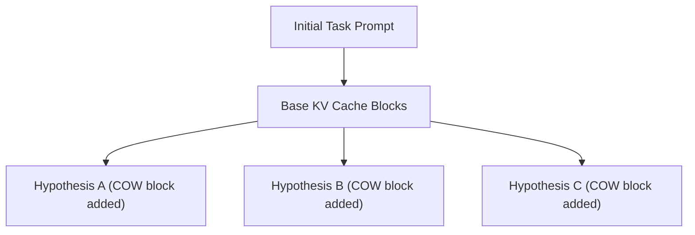

# Multi-Turn Agentic Task Search and Tree Routing Loops

Agentic task search runs complex reasoning loops like Monte Carlo Tree Search (MCTS) or long-horizon lookahead steps.

## Overview
Copy-on-write page sharing allows agent graphs to explore thousands of branching alternative hypotheses concurrently.

## Significance
* **VRAM Protection:** Prevents VRAM exhaustion during exhaustive tree routing exploration.
* **Low Latency Reasoning:** Avoids re-processing the baseline KV cache when evaluating alternative agent actions.

---
[← Back to README](file:///C:/Users/ishan/Documents/Projects/Awesome-Paged-Attention/README.md)
