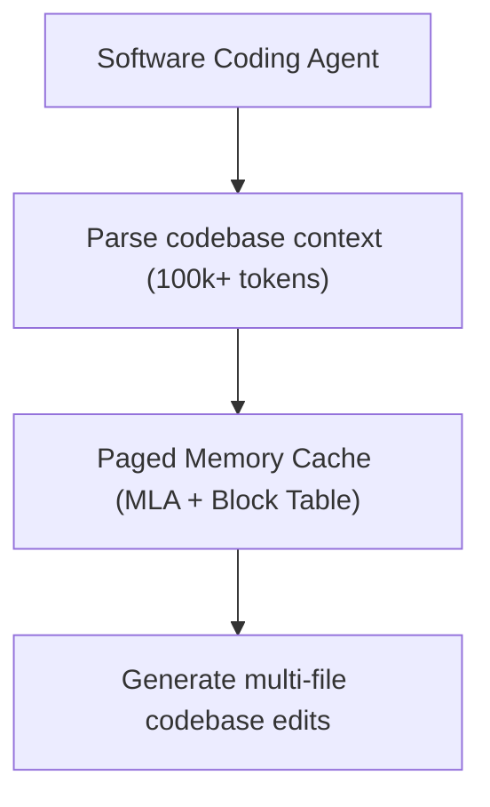

# Autonomous Software Engineering & Multi-File Repository Maintenance

Autonomous software agents require reading and editing huge contexts containing multiple codebases, documentation, and logic trees.

## Overview
Combining PagedAttention block routing with low-rank latent attention compression (MLA) enables software agents to maintain complex dependencies.

## Benefits
* **Long Context Windows:** Avoids VRAM starvation during code lookup and structural parsing.
* **Efficient Context Switching:** Switches files and workspaces without rebuilding the cache from scratch.

---
[← Back to README](file:///C:/Users/ishan/Documents/Projects/Awesome-Paged-Attention/README.md)
