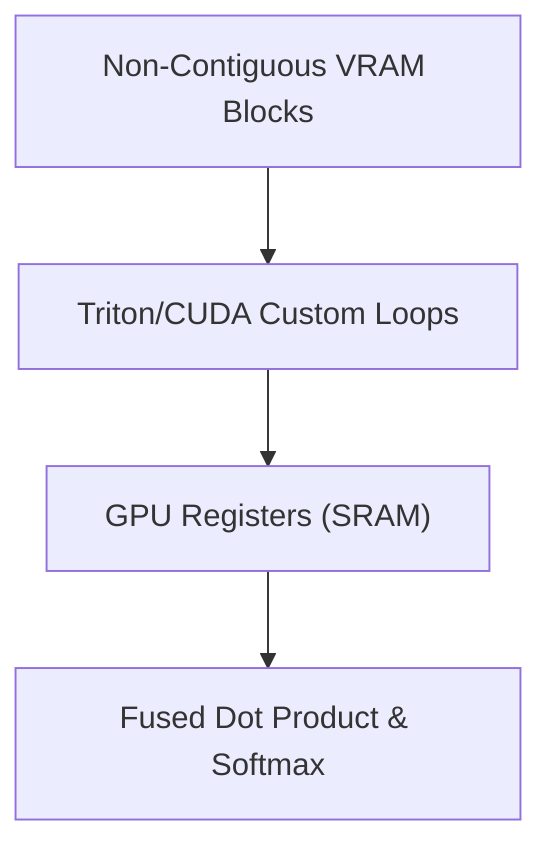

# Block-Fused Attention Kernels

Standard attention libraries require contiguous memory, which fails when KV caches are stored in non-contiguous pages.

## Overview
Block-Fused Attention rewrites low-level GPU loops (e.g., custom CUDA/Triton) to fetch memory in fixed chunks (e.g., 16 or 32 tokens) directly into GPU SRAM registers.

## Significance
* **Hardware-Aware Execution:** Combats memory fragmentation at the compute level.
* **Elimination of Extra Copies:** Directly processes tiled data without intermediate memory copy operations.

---
[← Back to README](file:///C:/Users/ishan/Documents/Projects/Awesome-Paged-Attention/README.md)
