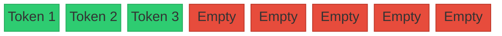

# The Contiguous Over-Allocation Era (Traditional LLM Serving)

In early serving infrastructures for Large Language Models (LLMs) before 2023, GPU memory allocation for the Key-Value (KV) cache was rigid and contiguous.

## Overview
Traditional systems reserved a contiguous memory region sized to the model's maximum possible sequence length (e.g., 2048 or 4096 tokens) for each request, regardless of the prompt's actual length.

## Key Challenges
* **Internal Fragmentation:** Unused allocated space within the pre-allocated block.
* **External Fragmentation:** Free memory blocks too small to satisfy new requests.
* **Low Batch Concurrency:** Massive VRAM waste restricted the number of parallel requests a GPU could handle.

---
[← Back to README](file:///C:/Users/ishan/Documents/Projects/Awesome-Paged-Attention/README.md)
