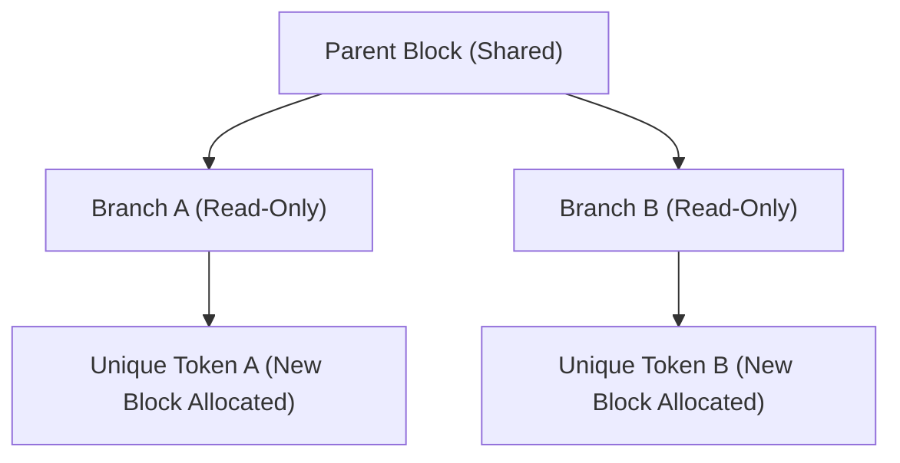

# Copy-on-Write Parallel Sampling (Tree Decoding)

Copy-on-Write enables parallel sampling and tree decoding paradigms (e.g. beam search, speculative decoding) without duplicating parent KV blocks.

## Overview
When multiple branches share a common prefix sequence, they point to the exact same physical memory blocks. A branch only allocates a new physical block when a unique token is written.

## Advantages
* **90%+ Memory Savings:** Prevents VRAM exhaustion during beam search or multi-hypothesis generations.
* **Instant Branching:** Extremely low overhead.

---
[← Back to README](file:///C:/Users/ishan/Documents/Projects/Awesome-Paged-Attention/README.md)
