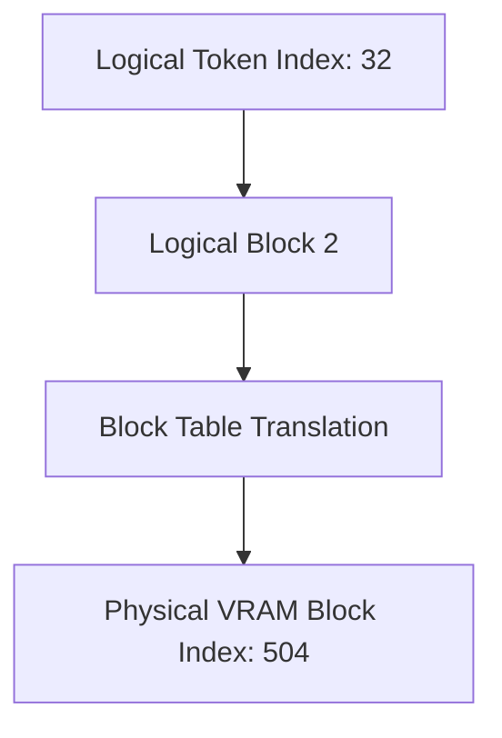

# Logical Block Tables

Logical Block Tables act as the address translation layer in PagedAttention, mapping logical sequences to physical VRAM.

## Overview
A block table maps logical block indexes (groups of tokens) to actual physical VRAM coordinates.

## Function
* **Address Translation:** Maps sequential token indices directly into disorganized VRAM coordinates.
* **Metadata Tracking:** Manages reference counts for each block to support copy-on-write sharing.

---
[← Back to README](file:///C:/Users/ishan/Documents/Projects/Awesome-Paged-Attention/README.md)
