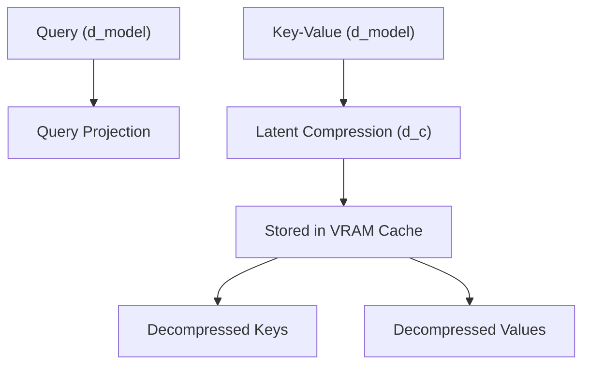

# The Fused Low-Rank Latent Cache Era (MLA)

Multi-Head Latent Attention (MLA) addresses the memory wall by compressing the Key-Value (KV) cache dimension.

## Overview
MLA compresses KV keys and values into a low-rank latent representation before storing them in memory, greatly reducing the VRAM footprint.

## Significance
* **93%+ Slashed VRAM Cache Footprint:** Completely rewrites the economics of long-context token serving.
* **Low-Rank Joint Compression:** Reduces memory throughput during decoding phase.

---
[← Back to README](file:///C:/Users/ishan/Documents/Projects/Awesome-Paged-Attention/README.md)
