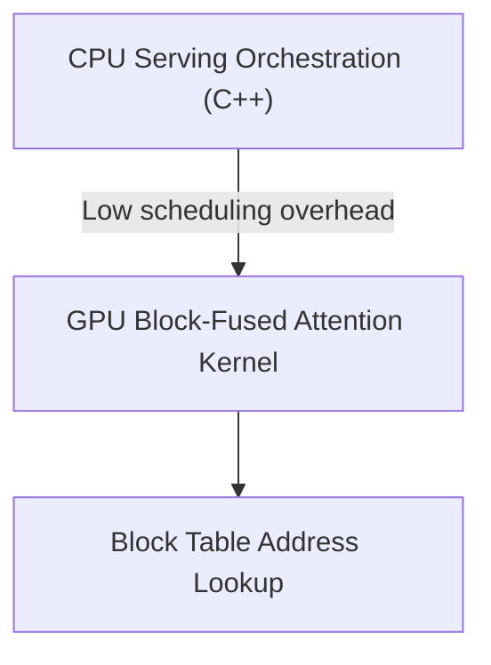

# The Metadata Lookup and Kernel Launch Latency Penalty

Frequent address translations and lookup overheads can lead to CPU-GPU launch latencies and underutilize tensor cores.

## Overview
Because logical block index values must be resolved to physical coordinates continuously at every autoregressive step, metadata coordination can create a latency bottleneck.

## Mitigations
* **Block-Size Optimization Tuning:** Sizing blocks (e.g. 32 or 64 tokens) to decrease the number of block table rows.
* **Compiled C++ Runtime Managers:** Offloading scheduling to high-performance C++ execution engines to minimize CPU-GPU overheads.

---
[← Back to README](file:///C:/Users/ishan/Documents/Projects/Awesome-Paged-Attention/README.md)
