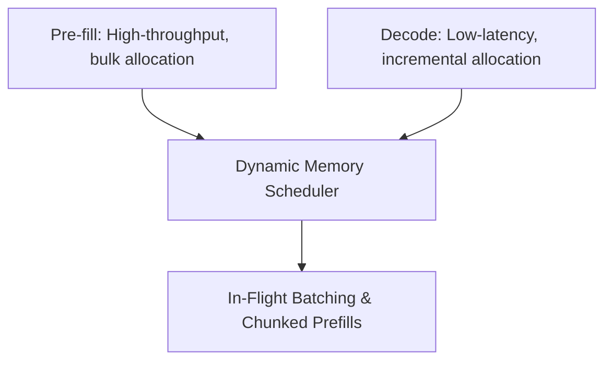

# The Pre-fill vs. Decode Allocation Asymmetry

Prefill (prompt processing) and decoding (token generation) have fundamentally different memory allocation patterns.

## Overview
* **Pre-fill Phase:** Processes initial user prompt inputs all at once, requiring large contiguous chunks of KV cache.
* **Decoding Phase:** Generates tokens sequentially, requiring incremental, single-block allocations over time.
Running them concurrently causes memory allocation thrashing.

## Mitigations
* **Chunked Prefills:** Breaking large prompts into smaller, manageable chunks.
* **In-Flight Batching:** Interleaving prompt chunks with active decoding generation tokens across execution batches.

---
[← Back to README](file:///C:/Users/ishan/Documents/Projects/Awesome-Paged-Attention/README.md)
