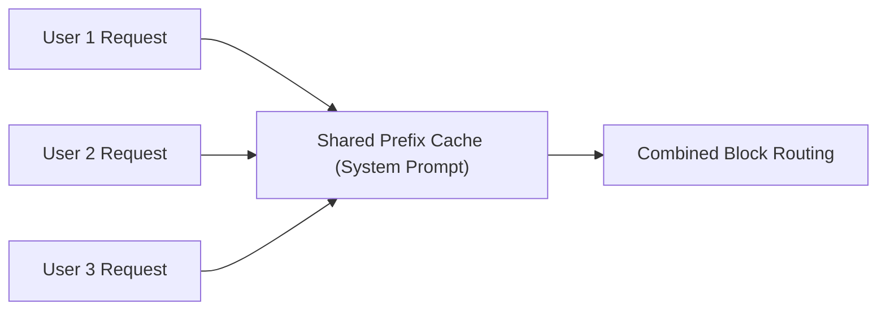

# Prefix Caching / Prompt Sharing

Prefix Caching caches common system prompts, conversational histories, or legal framework contexts across independent user requests.

## Overview
Multiple users querying the system share a cached sequence of physical KV blocks.

## Benefits
* **High Memory Efficiency:** Prevents duplicate storage of long guidelines and context histories.
* **Increased Throughput:** Direct lookup paths reduce prefill latency for common prefix sequences.

---
[← Back to README](file:///C:/Users/ishan/Documents/Projects/Awesome-Paged-Attention/README.md)
