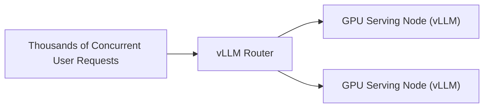

# High-Throughput Commercial SaaS serving (vLLM Deployments)

PagedAttention serves as the core orchestration engine underpinning modern high-throughput enterprise chatbot services.

## Overview
Enterprise deployments utilize compiled block tables and custom fusion layers to serve thousands of concurrent users per GPU node stably.

## Production Scaling
* **High Batch Size Ceiling:** High VRAM recovery lets servers pack more users into active inference loops.
* **Stable SLA:** Guarantees predictable generation speeds and response times under high-concurrency server loads.

---
[← Back to README](file:///C:/Users/ishan/Documents/Projects/Awesome-Paged-Attention/README.md)
