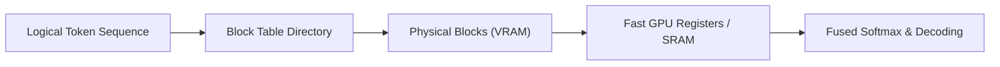

# Vanilla PagedAttention (Dynamic Block Tiling)

Vanilla PagedAttention is the base variant that dynamic maps logical token sequences to physical memory tiles on-the-fly.

## Overview
As tokens are generated, the attention kernel fetches non-contiguous blocks from memory using the block table and loads them into fast registers.

## Details
* **On-the-fly Mapping:** Resolves addresses dynamically at runtime.
* **Coalesced Memory Access:** Reads block tables sequentially, fetching non-contiguous blocks contiguously into registers.

---
[← Back to README](file:///C:/Users/ishan/Documents/Projects/Awesome-Paged-Attention/README.md)
