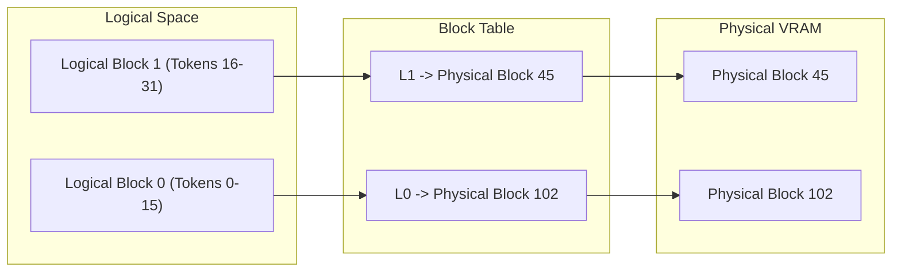

# The Virtual Memory Paging Revolution (PagedAttention / vLLM)

PagedAttention adapts virtual memory paging concepts from traditional operating systems to GPU VRAM for storing the Key-Value (KV) cache.

## Overview
Instead of allocating contiguous blocks, PagedAttention partitions the KV cache of a sequence into small, non-contiguous physical blocks.

## Benefits
* **Zero Fragmentation:** Recovers ~96% of wasted memory.
* **Higher Concurrency:** Enables 4x to 5x higher throughput compared to traditional systems.
* **Flexible Sharing:** Easy caching of shared prompts.

---
[← Back to README](file:///C:/Users/ishan/Documents/Projects/Awesome-Paged-Attention/README.md)
